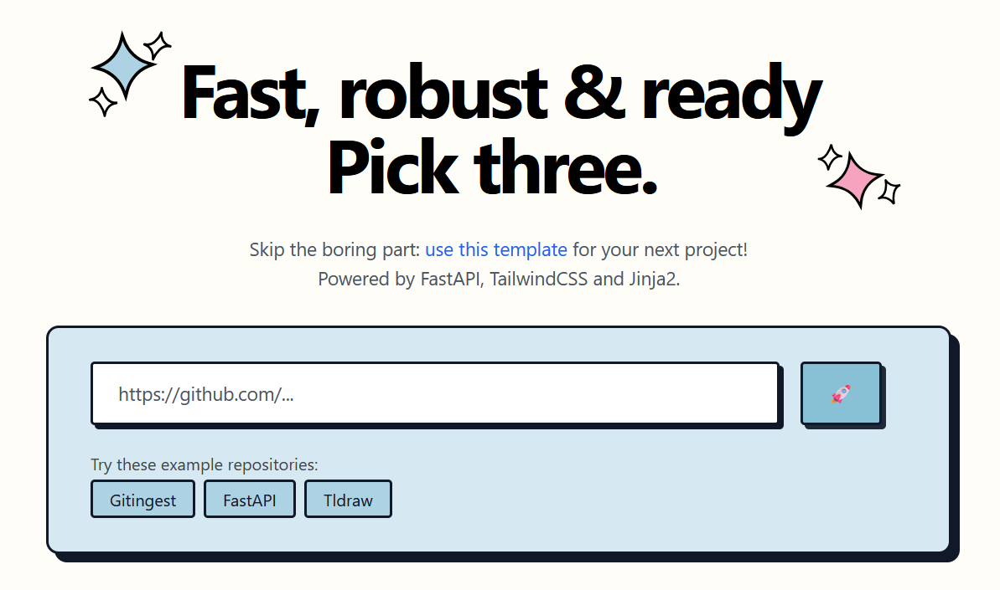

# Gitemplate

[](https://gitemplate.com)
[](LICENSE)
[](https://www.python.org/downloads/)
[](https://fastapi.tiangolo.com)
[](https://github.com/psf/black)

A production-ready FastAPI template specifically designed for building AI/LLM-powered web applications.

- 🤖 Optimized for LLM integration and AI workflows
- 🚀 FastAPI for high-performance API development
- 🎨 Jinja2 templating engine
- 💅 TailwindCSS for utility-first styling
- ⚡️ Deploy your app in just an hour

Here are some projects based on this template: [gitingest.com](http://gitingest.com) and [gitdiagram.com](http://gitdiagram.com).

We'd love to see what you build! Share your projects in our [Discussions](https://github.com/atyrode/gitemplate/discussions) section and become part of our growing ecosystem.

## TL;DR

You may copy and paste the following code block to get started:

```bash
git clone https://github.com/atyrode/gitemplate.git && cd gitemplate
python -m venv venv && source venv/bin/activate  # Windows: `venv\Scripts\activate`
pip install rich
python template.py -i
cd src && python -m uvicorn server.main:app --reload
```

You can now start developping in the `src/your_package_name/main.py` file. This is the entrypoint of your service.

## ✨ Features

- **Production-Ready Structure**: Organized project layout following best practices
- **Modern Stack**:
  - FastAPI for high-performance APIs
  - Jinja2 templating engine for the front-end
  - TailwindCSS for modern styling
- **Security**:
  - Built-in rate limiting
  - Trusted host middleware
  - Security headers configuration
  - CORS configuration
  - Environment variables management
- **Deployment Ready**:
  - Docker support with multi-stage builds
  - GitHub Actions workflows for:
    - CI/CD pipeline
    - PyPI publishing
    - Docker image building
  - Health check endpoints
  - Production-grade logging
- **Developer Experience**:
  - Pre-configured development tools:
    - Black for code formatting
    - isort for import sorting
    - pylint for code analysis
    - mypy for type checking
    - pytest for testing
  - Pre-commit hooks for code quality
  - Type hints and comprehensive docstrings
  - Hot reload during development
- **Template System**:
  - Easy customization through `template.py`
  - Flexible project structure
  - Configurable dependencies

## 🚀 Quick Start

1. Use this template by clicking "Use this template" on GitHub or clone it:

```bash
git clone https://github.com/atyrode/gitemplate.git
cd gitemplate
```

2. Create and activate a virtual environment:

```bash
python -m venv venv
source venv/bin/activate  # On Windows: `venv\Scripts\activate`
pip install rich # For better logging
```

3. Set up your project details in `template.py`:

```python
author: "Your Name"
package_name: "your_package"
project_name: "Your Project"
...
```

4. Apply the template:

```bash
python template.py
```

5. Run the development server:

```bash
cd src
python -m uvicorn server.main:app --reload --host 0.0.0.0 --port 8000
```

Visit `http://localhost:8000` to see your application running!
You can now start developping in the `src/your_package_name/main.py` file. This is the entrypoint of your service.

## 💻 Development

### Running Tests

```bash
pytest
```

### Code Formatting

The project uses pre-commit hooks to maintain code quality:

```bash
# Format code
black .

# Sort imports
isort .

# Lint code
pylint src/

# Run pre-commit hooks
pre-commit run --all-files

# Or install pre-commit hooks to run automatically
pre-commit install
```

### Docker Support

Build and run using Docker:

```bash
docker build -t your-app-name .
docker run -p 8000:8000 your-app-name
```

## 🤝 Contributing

Contributions are welcome! Please read our [Contributing Guidelines](CONTRIBUTING.md) for details on how to submit pull requests, report issues, and contribute to the project. In its current state, the file is templated, but it should give
you a good starting point.

## 📄 License

This project is licensed under the MIT License - see the [LICENSE](LICENSE) file for details.

## Palette

The colors used for this project are the following:
https://coolors.co/4a8394-62aec5-88c0d5-add2e4-ffffff-f678a7-ee5c8d-e64072-d91c55

## 🙏 Acknowledgments

- [FastAPI](https://fastapi.tiangolo.com/) for the amazing web framework
- [Jinja2](https://jinja.palletsprojects.com/) for templating
- [TailwindCSS](https://tailwindcss.com/) for styling
- [Gitingest](https://gitingest.com/) for the inspiration

## ⭐ Project Growth

[](https://star-history.com/#atyrode/gitemplate&Date)
